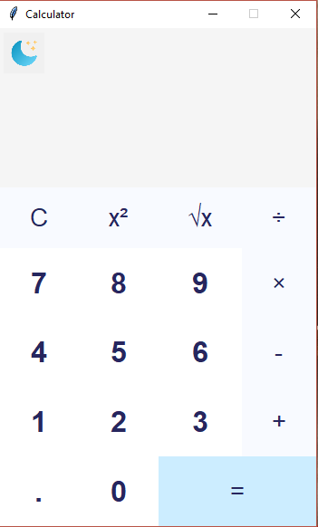

# Python GUI Calculator using Tkinter
## Introduction
I hope you already have a basic understanding of Python-based calculator programs and are eager to transition into creating a Graphical User Interface (GUI) for better presentation and reusability. Tkinter, the standard GUI toolkit for Python, will be used in this project to develop an interactive calculator application.

## Project Overview
Before diving into the code, let’s outline the key aspects of the calculator we will build, its functionalities, and its essential components.

### Features of the GUI Application
The application will include:
* Equation Display Area: A screen to show mathematical expressions and results.

* Clickable Buttons: Buttons for numerical values and mathematical operations.

* Core Mathematical Operations: Support for addition, subtraction, multiplication, and division.

### Functionalities:

* Calculate results (=).

* Clear the equation display (C).

* Calculate Square (x²).

* Calculate Square Root (√).


# Getting Started

## Prerequisites
To work on this project, you need to have the following installed:

* Python 3.x

* Visual Studio Code (or your preferred IDE)
 

## Installation

Clone the repository from GitHub:

```bash
  git clone https://github.com/tayade-aniket/claculator_project_NHIS.git
```

Install any required Python libraries:

```bash
  pip install tkinter
```

Open the project in Visual Studio Code and start coding!


## Screenshot
Below is an example of the expected GUI layout of the calculator application:

#### Light Theme


#### Dark Theme


### Happy Coding! 🎉